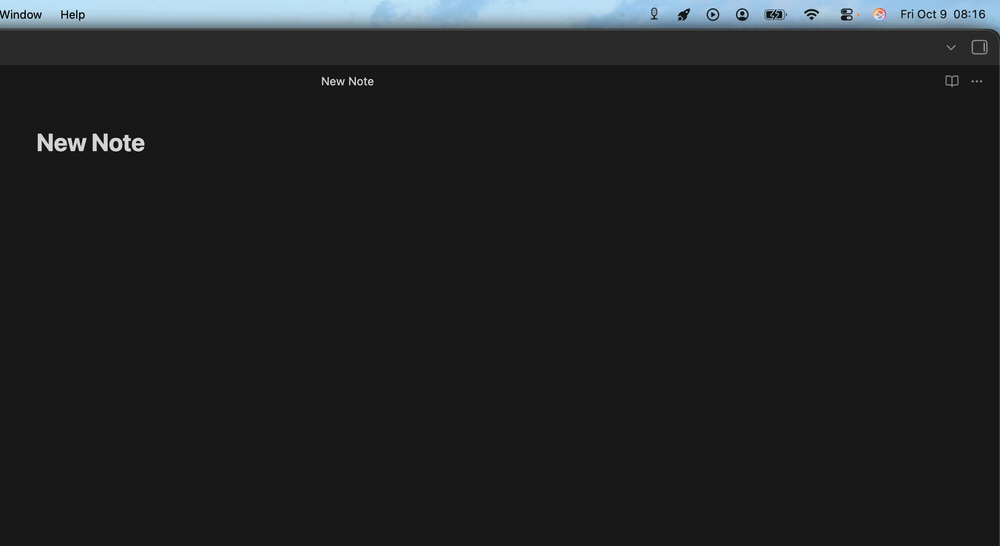

# Whispering

Whispering is a local speech-to-text app built with Tauri, Rust, and `whisper-rs`. It records from the microphone, transcribes with Whisper, and types the result at the focused cursor. Everything runs locally on your machine.

## Demo



## Requirements

- Rust toolchain via `rustup`
- Node.js and npm
- Tauri CLI: `cargo install tauri-cli`

Platform-specific setup:

- **macOS** — macOS 10.15 or newer.
- **Linux** — Tauri build packages:

  ```bash
  sudo apt update
  sudo apt install libwebkit2gtk-4.1-dev build-essential curl wget file libxdo-dev libssl-dev libayatana-appindicator3-dev librsvg2-dev
  ```

- **Windows** — PowerShell, Microsoft C++ Build Tools with "Desktop development with C++", and the Microsoft Edge WebView2 runtime. If MSI bundling fails with `light.exe` errors, enable the Windows VBSCRIPT optional feature.

No model download is needed by hand; the install step below fetches the default Whisper model for you.

## Install

From the repo root:

```bash
make install
```

`make install` detects your operating system, downloads the default Whisper model, builds the native release app, installs it, and prints how to launch it.

Launch the installed app at any time:

```bash
make run-macos-app    # macOS
make run-linux-app    # Linux
make run-windows-app  # Windows
```

## Use

Start and stop recording with the global shortcut:

| Platform | Shortcut     |
| -------- | ------------ |
| macOS    | `Ctrl+Cmd+M` |
| Windows  | `Ctrl+Alt+M` |
| Linux    | `Ctrl+Alt+M` |

The first time you use Whispering, grant **Accessibility** permission so it can type the transcribed text at your cursor, and **Microphone** permission so it can record. On macOS, both are under **System Settings → Privacy & Security**.

Transcribed text is typed wherever your cursor is. If text injection fails, the latest transcript is kept at `<cache dir>/Whispering/transcripts/latest.txt` so nothing is lost.

## License

MIT — see [LICENSE](LICENSE).
